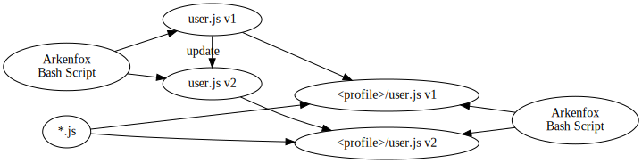
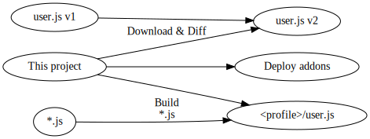

# Provisioning Firefox Profiles

This project is an attempt to fully deploy (provision) a fresh Mozilla Firefox install, that incorporates the security hardening settings from the [Arkenfox/user.js](https://github.com/arkenfox/user.js) project.
This is for version 104.0, which is after the migration to WebExtensions API.
In particular that means:

* [x] Configure advanced settings (`about:config`) via `user.js`
* [x] Download addons and lanugage packs
* [ ] Install language packs and populate `General > Language` locales
* [ ] Install addons (aka. extensions)
* [ ] Save addon settings
* [ ] Search bar installation and settings
* [ ] Create a fresh profile (unsure if I want to do this)
* [x] Provision a fresh profile
* [ ] Add addons to saved UI layout (unsure we want to do this)

Inspired by things tools such as Nix, Terraform, and Ansible, this project is trying to create fully configured Firefox at the click of one button.
Additionally, this project provides a nice CLI interface to keep up with updates from Arkenfox.

# TODO

In addition the list above:

* [ ] Tracking updates from the upstream Arkenfox project
* [ ] Tab completion via `${COMP_LINE}`

# How this differs from Arkenfox workflow

```
<<EOF dot -Tsvg >"images/arkenfox.svg"
digraph {
  rankdir="LR"
  ArkenfoxL[label="Arkenfox\nBash Script"href="https://github.com/arkenfox/user.js"]
  Template1[label="user.js v1"]
  Template2[label="user.js v2"]
  Output1  [label="<profile>/user.js v1"]
  Output2  [label="<profile>/user.js v2"]
  ArkenfoxR[label="Arkenfox\nBash Script"]

  ArkenfoxL -> Template1;
  ArkenfoxL -> Template2;
  ArkenfoxR -> Output1;
  ArkenfoxR -> Output2;

  Template1 -> Template2 [label="update"]

  "*.js"    -> Output1
  Template1 -> Output1
  "*.js"    -> Output2
  Template2 -> Output2

  { rank=same; Template1; Template2; }
  { rank=same; ArkenfoxL; "*.js"; }
  { rank=sink; ArkenfoxR; }
}
EOF
```




This is based on the work of [Arkenfox](https://github.com/arkenfox/user.js) project.
The workflow of the Arkenfox project is that, after git cloning the project into a directory, they provide provide you with `user.js` that has defaults that are not intended to be useable out-of-the-box.
You create any number of additional JavaScript files that will override those settings, customised to your particular needs.
Then you use the script in the Arkenfox project to combine all the JavaScript files and copy to `<firefox-profile>/user.js` (e.g. `/home/jane-doe/.mozilla/firefox/34ahf5xy.default/user.js`
Additionally, you use the script to update the provided default `user.js`.


```
<<EOF dot -Tsvg >"images/project.svg"
digraph {
  rankdir="LR"
  Project  [label="This project"]
  Template1[label="user.js v1"]
  Template2[label="user.js v2"]
  Output   [label="<profile>/user.js"]

  Template1 -> Template2
  Project   -> Template2 [label="Download & Diff"]

  Project -> "Deploy addons"
  Project -> Output /* label should be for this edge but it looks better lower */
  "*.js"  -> Output [label="Build\n*.js"]
  { rank=same; Template2; "Deploy addons"; }
}
EOF
```




The workflow of this project creating the `<profile>/user.js` from just the JavaScript files.
The Arkenfox's `user.js` template file is used only to compare versions to see what has changed since the previous version.
Any updates that you like you can copy over to your JavaScript files.
Additionally, this project provides methods for diffing a local copy of Arkenfox's `user.js` and online version of Arkenfox's most up-to-date `user.js`.

# Steps moving forward

It seems not possible to fully automate extension installation.
There seem to be several disparate locations that settings are stored for addons (see next section).
Thus, targetting specific files in the profile directory is not very reliable.

I did try using the WebDriver API, i.e. using the Selenium framework to talk through the `geckodriver` proxy to programmatically control a Firefox instance.
The goal would be to automate the browser to click on settings to configure each extension or to import settings.
However, I've seen competing claims that Selenium explicitly does or does not officially support connecting to an already running instance of Firefox.

Another possible route would be to connect Selenium to the debugger.
Although I was successful at making Selenium open a new instance (as one would do for normal webscrapping or integration testing), I could not figure out how to connect it to an already running Firefox instance.

# Minimal Firefox Setup for storing addon settings

The five extensions I use are:

* [ublock-origin](https://addons.mozilla.org/en-GB/firefox/addon/ublock-origin)
* [NoScript](https://addons.mozilla.org/en-GB/firefox/addon/noscript) for blocking specific domains. Although uBlock Origin offers JavaScript blocking and having less extensions means less liabilities, NoScript allows me to have fine-grain control over specific domains I want to allow.
* [cookie-autodelete](https://addons.mozilla.org/en-GB/firefox/addon/cookie-autodelete)
* [history-cleaner](https://addons.mozilla.org/en-GB/firefox/addon/history-cleaner) to clear history at startup. History is on vector for finger printing, and I cannot use Firefox's clear history on exit if I want session restore, i.e. I cannot use "Privacy & Security > History > Clear history when Firefox closes > Browser & Download History" if I want "General > Startup > Open previous windows and tabs".
* [Video Speed Controller](https://addons.mozilla.org/en-GB/firefox/addon/videospeed) adds controls for consuming media at increased or decreased speeds. There is no way to export settings for this extension.

XPI files are just zip files.
Just putting downloaded addons in the `extensions/` directory is not sufficient.
Addons must also be registered (enabled, update schedule, available in private browsing), and you the addon configuration must be stored somewhere.

* `extensions/` for the .xpi files, or the actual addons and language packs.
* `storage/` is used for most extensions to store settings (it seems)
* `addons.json` is used in combination with `extensions.json` and `extensions.webextensions.uuid` to register addons
* `extension-preferences.json` is used store which addons are available during private browser sessions (implemented as a 'container').
* `extensions.json`, see `addons.json`
* `storage-sync-v2.sqlite` and its siblings are for used by NoScript to store the settings for specific domains
* `storage-sync-v2.sqlite-shm`
* `storage-sync-v2.sqlite-wal`
* `user.js` (alternatively `pref.js`, but `pref.js` is essentially the browser store of `about:config` settings). The two main settings of concern are:
** `browser.uiCustomization.state` is for customising the layout of the browser (for display addon icons)
** `extensions.webextensions.uuids`, see `addons.json`

Most of this testing was done by progressively deleting all files and just adding back a ever-narrowing list of files and seeing what of the five extensions I use break.
I am not entirely sure what the difference is between `addons.json`, `extensions.json`, and `extensions.webextensions.uuids` for the purposes of registering addons.

I am currently unsure if UUIDs for extensions change if you update them.
If they do, then storing the `browser.uiCustomisation.state`, `extensions.json`, etc. is a bit fragile.

# Useful links

* [Arkenfox/user.js](https://github.com/arkenfox/user.js), formerly ghacks/user.js, that provides detailed documentation and bash script workflow for deploying firefox advanced settings (`about:config`) that are more privacy and security focused.

* `about:debugging` potentially for webdriver usage. Gives access to controlling through Firefox's debugger, firebug.
* `about:support` for a nice listing of all the diagnostic information, like what profile we are currently using.
* `about:profiles`
* `about:config`
* [ansible-firefox-addon) is the ansible role, aka. package, for installing addons](https://github.com/alza-bitz/ansible-firefox-addon). This is code target at before Firefox migrated from XPCOM/XUL extensions to the current WebExtensions API.
* [ansible-firefox](https://github.com/alza-bitz/ansible-firefox) is the ansible role that uses `ansible-firefox-addon` to also install user.js
* [Installing addons from scripts](https://askubuntu.com/questions/73474/) stackoverflow question. Again this is for pre-WebExtensions API. In particular
* [Shellnium](https://github.com/Rasukarusan/shellnium) is a WebDriver wrapper for bash that works via curl. It is primarily setup for Chrome, but the modifying it to work for Firefox should be simple.
* [Gecko driver issue](http://github.com/mozilla/geckodriver/issues/430)
